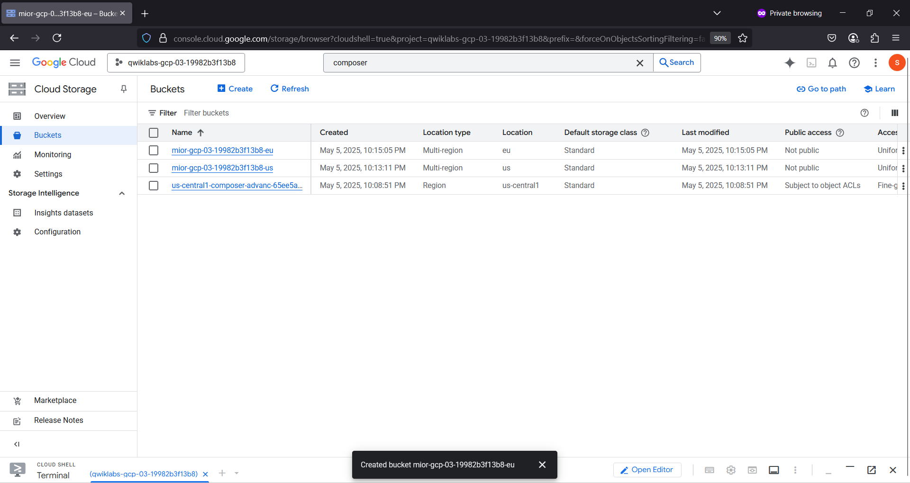
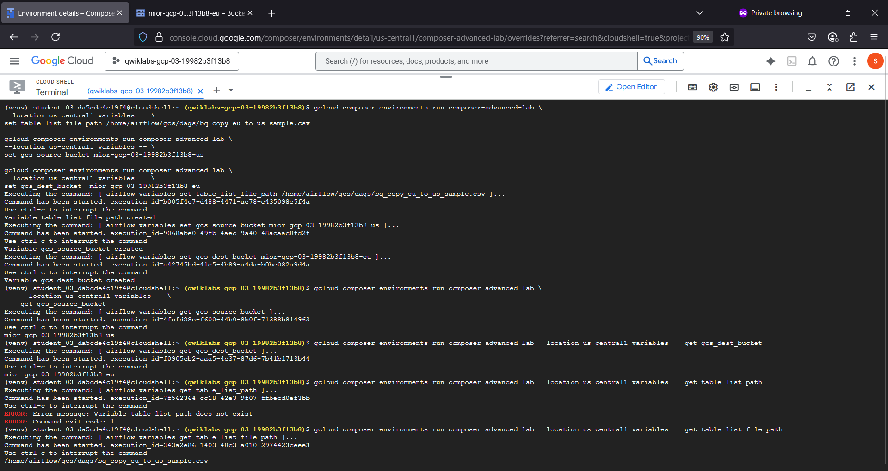
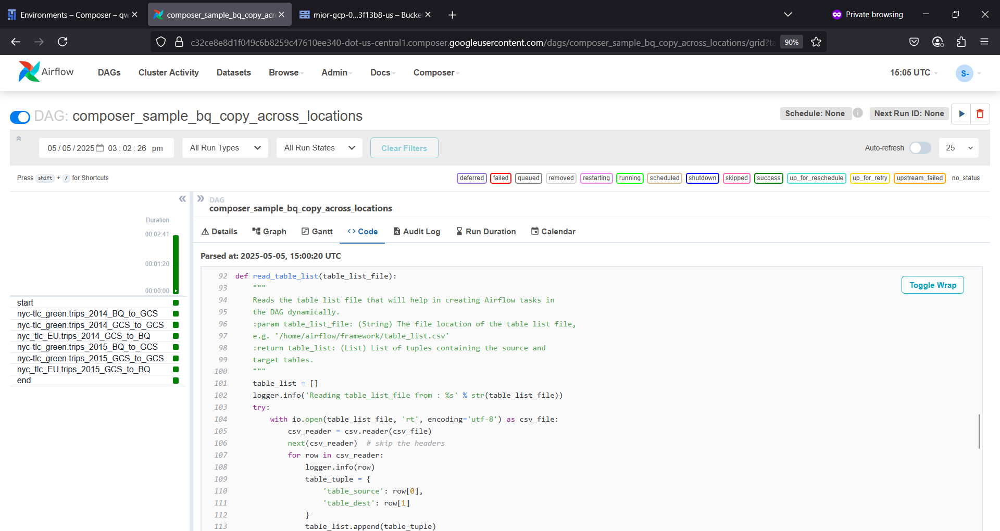
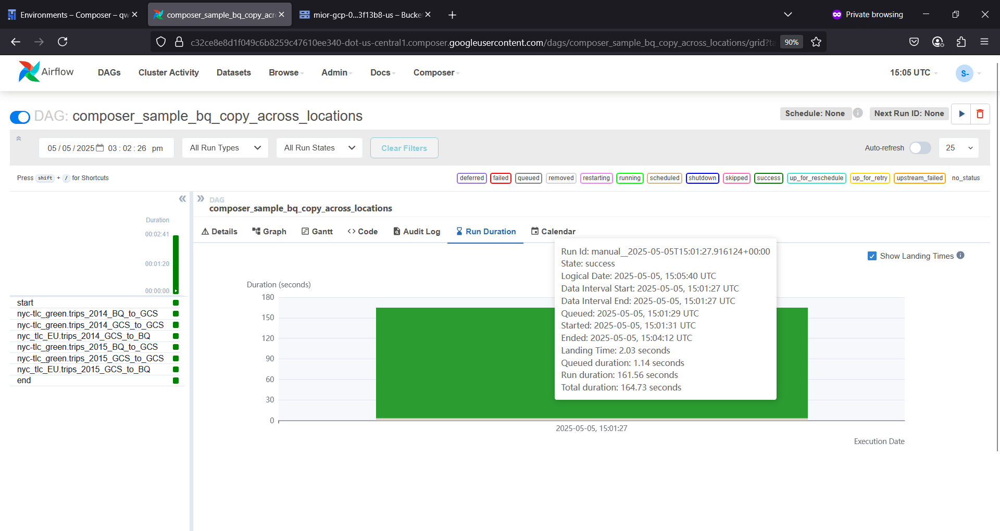
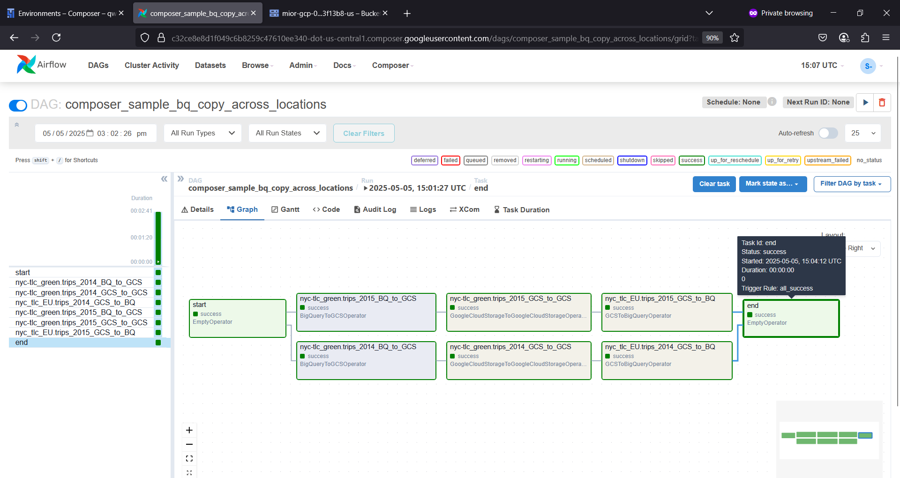
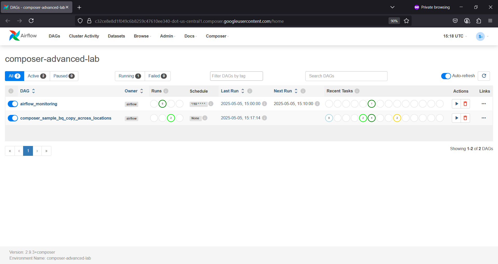
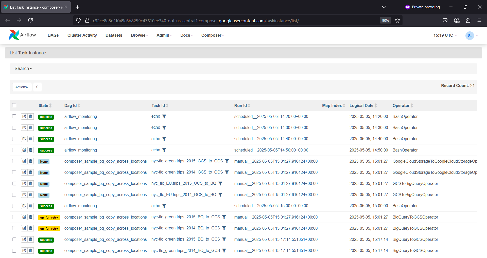
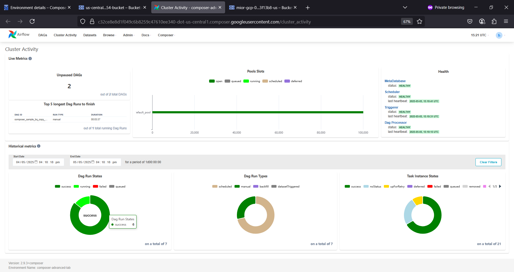
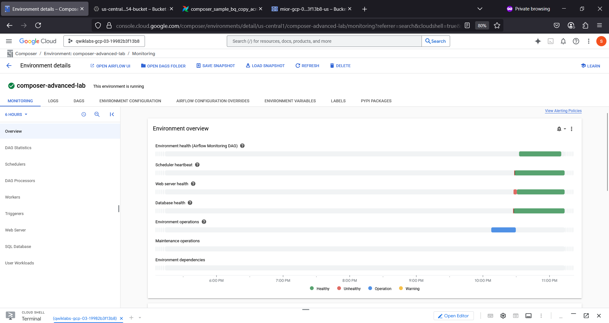
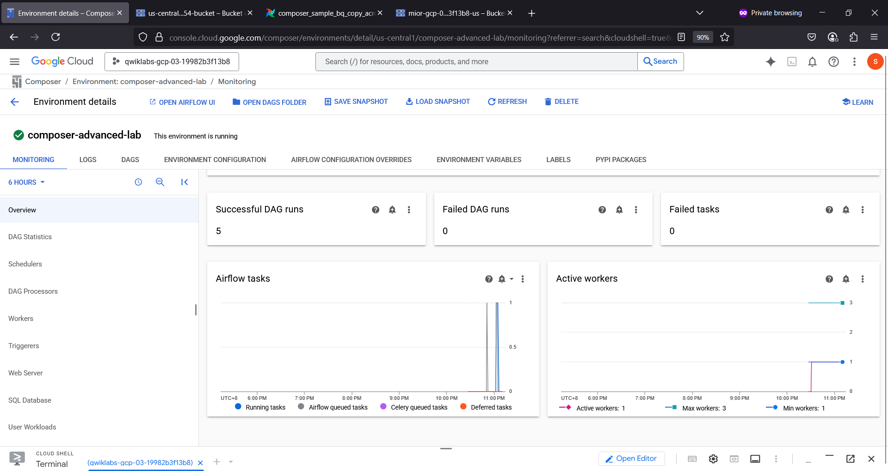

# airflowser 💠
airflowser : #airflow #composer #dag

## Objective
- Reads from a config file that provides a list of tables to copy
- Exports the list of tables from a BigQuery dataset located in US to Cloud Storage
- Copies the exported tables from the US to EU Cloud Storage bucket
- Imports the list of tables into the target BigQuery Dataset in EU

## Apache Airflow in Cloud Composer

